# AXI DMA — RTL-to-GDSII Physical Design (45nm)

A complete **RTL-to-GDSII physical design flow** for an AXI-compliant Direct Memory Access (DMA) controller, implemented on a **45nm technology node** using the **Cadence digital design suite** (Genus, Innovus, Tempus). The RTL for this project was sourced from an open **Team RTL repository** and carried through synthesis, floorplanning, power planning, placement, clock tree synthesis, routing, physical verification, and signoff-level static timing analysis to produce a clean, tapeout-ready GDSII layout.

---

## Table of Contents

- [Overview](#overview)
- [Key Results at a Glance](#key-results-at-a-glance)
- [Background](#background)
  - [AXI DMA](#axi-dma)
  - [Physical Design (RTL-to-GDSII)](#physical-design-rtl-to-gdsii)
- [Project Objectives](#project-objectives)
- [Literature Survey](#literature-survey)
- [Methodology](#methodology)
  - [1. RTL Design and Familiarization](#1-rtl-design-and-familiarization)
  - [2. Logic Synthesis — Cadence Genus](#2-logic-synthesis--cadence-genus)
  - [3. Floorplanning — Cadence Innovus](#3-floorplanning--cadence-innovus)
  - [4. Power Planning — Cadence Innovus](#4-power-planning--cadence-innovus)
  - [5. Placement — Cadence Innovus](#5-placement--cadence-innovus)
  - [6. Clock Tree Synthesis — Cadence Innovus](#6-clock-tree-synthesis--cadence-innovus)
  - [7. Routing — Cadence Innovus](#7-routing--cadence-innovus)
  - [8. Post-Route Analysis & Physical Verification](#8-post-route-analysis--physical-verification)
  - [9. Timing Signoff — Cadence Tempus](#9-timing-signoff--cadence-tempus)
- [Results](#results)
  - [Synthesis Results](#synthesis-results)
  - [Physical Implementation Results](#physical-implementation-results)
  - [GDSII Stream Out](#gdsii-stream-out)
  - [Timing Closure — Five Iteration Process](#timing-closure--five-iteration-process)
  - [Final Timing Signoff Results](#final-timing-signoff-results)
  - [Final Results Summary](#final-results-summary)
- [Conclusion](#conclusion)
- [References](#references)

---

## Overview

This repository documents the physical design implementation of an **AXI DMA controller**, starting from a functionally verified Verilog RTL (sourced from the Team RTL repository) and ending in a fully signed-off, DRC/connectivity-clean GDSII layout ready for fabrication.

- **Technology node:** 45nm CMOS
- **Clock:** `aclk` @ ~166.7 MHz (6 ns period)
- **Tools:** Cadence Genus 23.14 (synthesis), Cadence Innovus 23.14 (physical implementation), Cadence Tempus 23.14 (timing signoff)

## Key Results at a Glance

| Metric | Value |
|---|---|
| Technology | 45nm |
| Final standard cells | 13,845 (post-placement) / 14,226 (post-route) |
| Nets | 14,642 |
| I/O ports | 1,130 (388 input, 742 output) |
| Core area | ~52,580 µm² |
| Core utilization | 81.2% |
| Die dimensions | 284.6 µm × 305.33 µm |
| Metal layers | 8 (Metal1–Metal8) |
| DRC violations | 0 |
| Connectivity violations | 0 |
| Clock skew | 0.047 ns |
| Max clock latency | 0.279 ns |
| Setup WNS | +0.461 ns |
| Hold WNS | +0.053 ns |
| Total power | 3.216 mW @ 0.9V |

---

## Background

### AXI DMA

The **AXI Direct Memory Access (DMA)** engine is a high-performance IP core designed to provide high-bandwidth direct memory access between memory and AXI4-Stream target peripherals. In modern SoC architectures, the CPU is often bottlenecked by data movement tasks — the AXI DMA offloads these tasks by allowing hardware peripherals to read/write large blocks of data directly to system memory without continuous CPU intervention.

It uses the **AXI (Advanced eXtensible Interface)** protocol from the ARM AMBA specification family, ensuring low-latency communication and compatibility with high-speed memory controllers. The core supports scatter-gather capabilities and independent data channels for transmit (**MM2S**) and receive (**S2MM**) operations, making it essential for video processing, networking, and high-speed signal processing applications.

The RTL used in this project was **sourced from a Team RTL repository** and implements a complete AXI-compliant DMA controller, including AXI master/slave channel logic, write/read address channels, data buffering FIFOs, and address generation units:

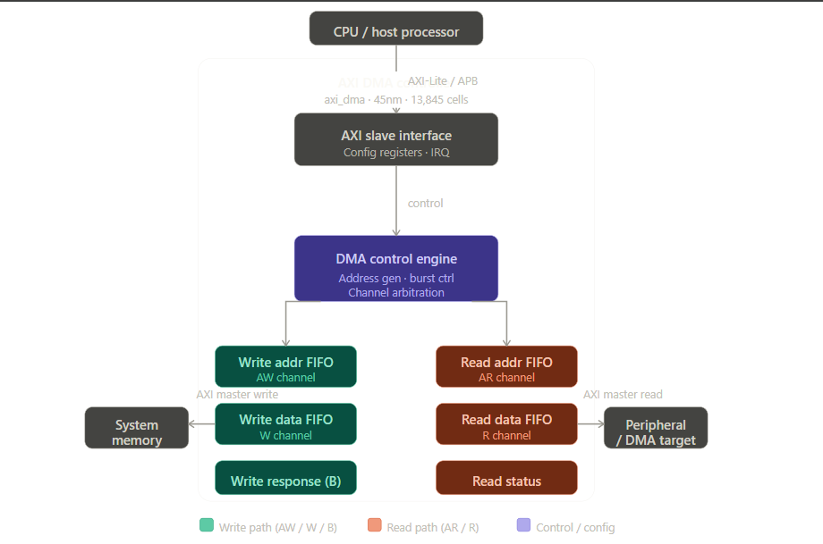
*AXI DMA controller block diagram — AXI slave configuration interface, central DMA control engine, write path (AW/W/B channels with FIFOs), read path (AR/R channels with FIFOs), and connections to system memory and peripheral targets.*

### Physical Design (RTL-to-GDSII)

**Physical Design** is the process of transforming a logical RTL description of an IC into a physical geometric representation (**GDSII**) that a semiconductor foundry uses to fabricate the chip. It is an iterative process constrained by **PPA (Power, Performance, Area)** targets, and involves:

- **Logic Synthesis** — converting RTL into a gate-level netlist using a target technology library.
- **Floorplanning & Power Planning** — defining chip boundaries and building a robust power grid to prevent IR drop.
- **Placement** — determining optimal physical locations for standard cells to minimize wirelength and congestion.
- **Clock Tree Synthesis (CTS)** — distributing the clock to all sequential elements while minimizing skew and insertion delay.
- **Routing** — interconnecting placed cells across metal layers while satisfying DRC rules.
- **Sign-off** — final timing, power, and physical rule (LVS/DRC) verification.

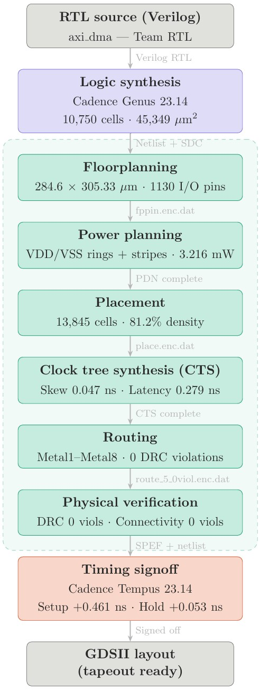
*Complete RTL-to-GDSII physical design flow adopted for the AXI DMA controller, showing tool names, key metrics, and intermediate output files at each stage.*

---

## Project Objectives

**Primary objective:** Implement a complete RTL-to-GDSII physical design flow for the AXI DMA controller using Cadence EDA tools, transforming the verified RTL into a fully placed, routed, and timing-signed-off layout ready for fabrication on a 45nm node.

**Specific objectives:**

1. **Logic Synthesis & Constraint Generation** — synthesize RTL into a gate-level netlist in Cadence Genus and generate an accurate SDC capturing clock definitions, I/O timing budgets, and path exceptions.
2. **Floorplanning & Power Planning** — define an optimal die/core area and build a robust Power Distribution Network (PDN) delivering uniform VDD/VSS at 0.9V while minimizing IR drop and electromigration risk.
3. **Placement & CTS** — achieve high-quality timing-driven placement at 81.2% utilization and synthesize a balanced clock tree (target skew < 0.1 ns).
4. **Signal Routing** — complete detailed routing across 8 metal layers with zero DRC violations and zero opens/shorts.
5. **Timing Closure & Signoff** — achieve full setup/hold timing closure via signoff STA in Cadence Tempus using SPEF-extracted parasitics and MMMC analysis.
6. **Physical Verification** — confirm zero DRC violations across all sub-regions and zero connectivity errors across 15,000+ nets, ensuring GDSII tapeout readiness.

**Broader learning objective:** hands-on mastery of the Cadence digital suite (Genus, Innovus, Tempus), including interpreting timing reports, resolving DRC violations, analyzing power, and making PPA trade-offs in a real design context.

---

## Literature Survey

This project's methodology is grounded in established VLSI physical design and signoff literature:

- **VLSI Physical Design — Graph Partitioning to Timing Closure:** Sherwani (1999) formalized physical design as a sequential optimization problem (partitioning, floorplanning, placement, routing, compaction) with inherently NP-hard spatial optimization at each stage. This directly informed the floorplan/utilization trade-off used here — a core boundary of 284.6 × 305.33 µm at 81.2% target utilization was chosen to maximize density without inducing routing congestion.

- **Clock Tree Synthesis & Skew Optimization:** Restle and Deutsch (2001) analyzed clock integrity degradation in deep-submicron nodes, where interconnect RC delay dominates over gate delay. Their guardband principles (structured H-tree/mesh topologies, buffer insertion) map directly to the CTS results achieved here — a skew of 0.047 ns (0.78% of the 6 ns period) and clock power of 0.387 mW (12.04% of total).

- **Static Timing Analysis & Nanometer Signoff:** Bhasker and Chadha (2009) detailed OCV modeling, CPPR, SI crosstalk analysis, and SPEF back-annotation for MMMC signoff. This framework was mapped onto the Tempus signoff stage, where `setup_func` and `hold_func` views were analyzed across two SI iterations covering 14,708 signal paths.

- **Power Distribution Network Design & IR Drop:** Pant, Panda, and Nalasivayam (2004) studied PDN design using ring-and-stripe VDD/VSS topologies to mitigate IR drop and electromigration in high-density layouts — directly applied in the power planning phase at 81.2% utilization and 0.9V supply.

- **AXI Protocol & On-Chip Interconnect:** ARM's AMBA AXI specification defines five decoupled transaction channels (Read Address, Read Data, Write Address, Write Data, Write Response) using valid/ready handshaking. This multi-channel architecture is directly reflected in the design's 388 input / 742 output pin distribution and 14,642-net routing complexity (avg. 3.72 pins/net, max 4,653 pins on the widest net).

---

## Methodology

The methodology follows the complete industry-standard ASIC physical design flow — RTL to GDSII — using **Cadence Genus** (synthesis), **Cadence Innovus** (physical implementation), and **Cadence Tempus** (timing signoff).

### 1. RTL Design and Familiarization

The starting point is the Verilog RTL of the AXI DMA controller, **sourced from the Team RTL repository**. Before synthesis, the RTL hierarchy was studied to understand clock domain structure, identify potentially critical timing paths, determine I/O interface requirements, and plan the constraint development strategy.

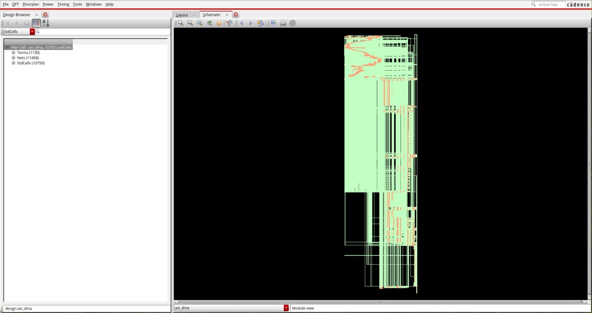
*Cadence Genus GUI showing the synthesized netlist layout/schematic view — Design Browser listing Terms (1130), Nets (11,668), and StdCells (10,750), confirming successful synthesis completion.*

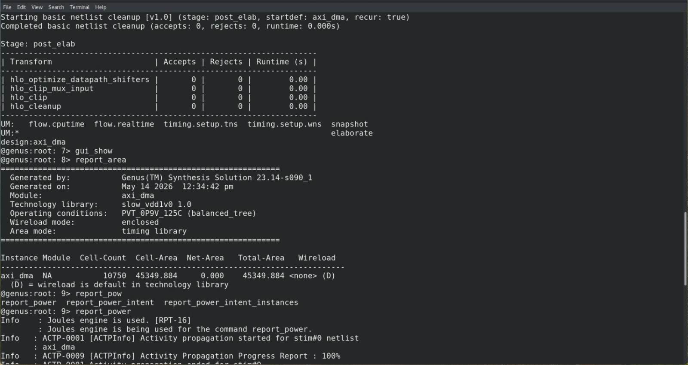
*Genus `report_area` output — 10,750 cells, cell area 45,349.884 µm², technology library `slow_vdd1v0`, operating condition `PVT_0P9V_125C`.*

### 2. Logic Synthesis — Cadence Genus

The Verilog RTL is synthesized using **Cadence Genus Synthesis Solution 23.14**, performing elaboration, technology mapping, and timing-driven optimization targeting the 45nm library under `PVT_0P9V_125C` (slow corner, 0.9V, 125°C). Synthesis runs in passes: generic synthesis (technology-independent mapping) → technology mapping (library cell substitution) → optimization (timing/area/power tuning).

Outputs handed off to Innovus:
- **Gate-level netlist (.v)** — all instantiated standard cells and connectivity.
- **SDC file** — clock definition (`aclk` @ 6 ns / ~166.7 MHz), I/O delay budgets, and path exceptions.

Post-synthesis `report_area` confirmed **10,750 standard cells** at **45,349.884 µm²** cell area.

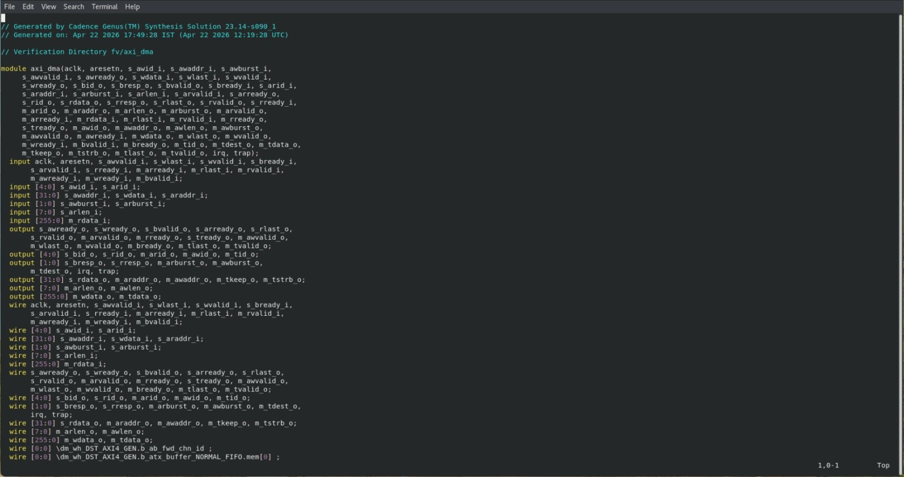
*Gate-level netlist generated by Genus showing the top-level module declaration with all 1,130 I/O ports.*

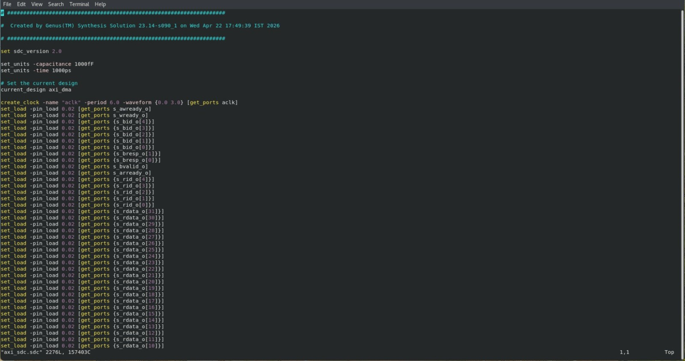
*Synopsys Design Constraints (SDC) file generated by Genus, capturing the complete timing environment for signoff-accurate implementation.*

### 3. Floorplanning — Cadence Innovus

The netlist and SDC are imported into **Cadence Innovus 23.14**. Floorplanning establishes the die/core boundaries at ~80% target utilization, balancing density against routing headroom:

- **Core dimensions:** 284.6 µm × 305.33 µm
- All **1,130 I/O ports** placed around the core periphery
- Placement rows and routing tracks configured per 45nm design rules

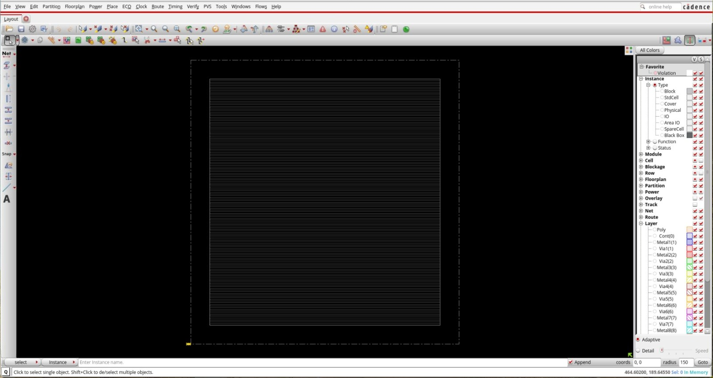
*Initial floorplan stage (`init_fp.enc.dat`) — empty core area with placement row tracks visible.*

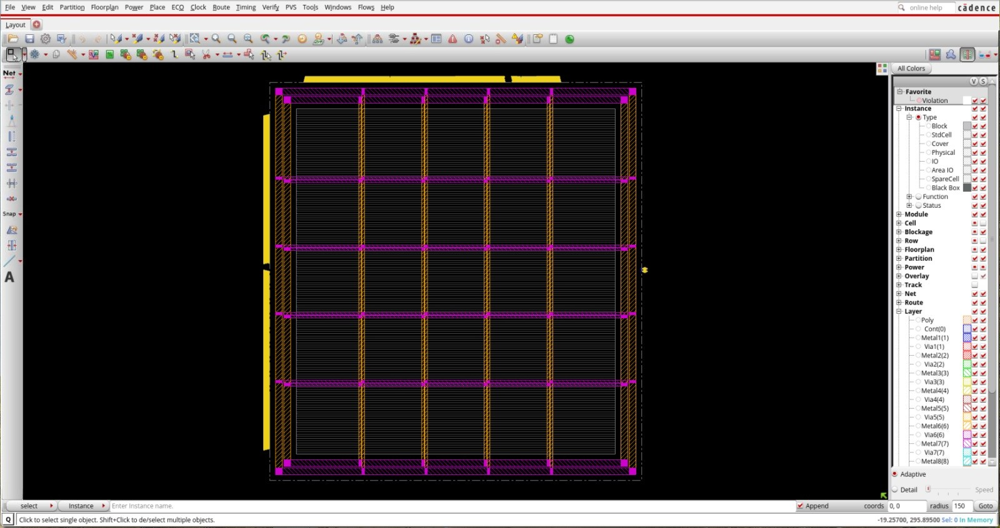
*Floorplan after I/O pin assignment (`fppin.enc.dat`) — power stripe structure (orange columns) and I/O pin locations (magenta markers).*

### 4. Power Planning — Cadence Innovus

The **Power Distribution Network (PDN)** is built in a hierarchical ring-and-stripe topology — power rings around the core boundary connecting to VDD/VSS pads, plus horizontal/vertical stripes in upper metal layers forming a low-resistance mesh across the 81.2%-utilized core.

Post-implementation static power analysis:

| Power Component | Value |
|---|---|
| Total power (VDD = 0.9V) | 3.216 mW |
| Internal power | 2.405 mW |
| Switching power | 0.8097 mW |
| Leakage power | 1.104 µW |
| Clock network (`aclk`) power | 0.387 mW (12.04%) |

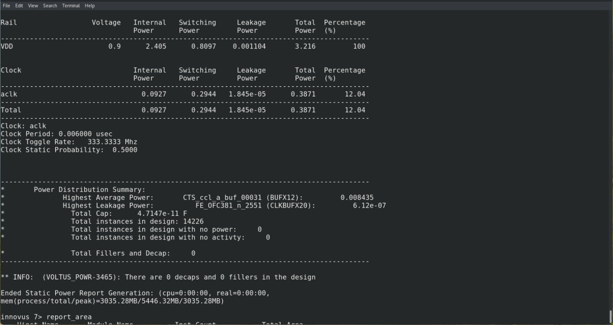
*Power report showing VDD rail at 0.9V, total power = 3.216 mW, clock network breakdown, and clock period = 6 ns.*

### 5. Placement — Cadence Innovus

Timing-driven placement distributes all **13,845 standard cells** across the core in two phases:

- **Global placement** — force-directed algorithm minimizing estimated wirelength/timing penalties while respecting utilization and congestion targets.
- **Detailed placement & legalization** — refines cell positions to align with placement rows, eliminating overlaps.

Post-placement `timeDesign` confirmed **zero violating paths**, setup **WNS of +0.461 ns**, TNS of 0.000 ns across 13,841 paths. All DRV checks (max_cap, max_tran, max_fanout, max_length) reported zero violations. Final density: **81.237%**.

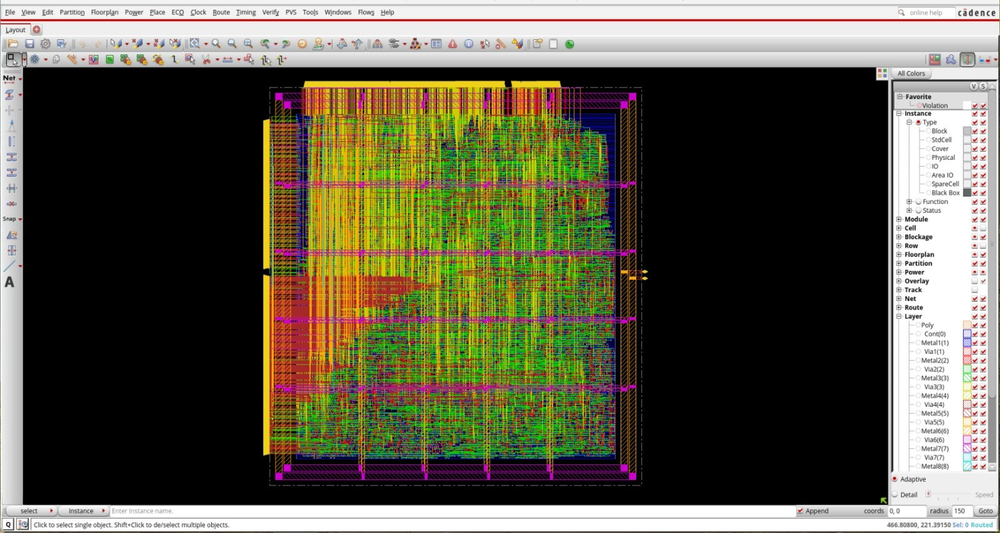
*Innovus post-placement layout view (`place.enc.dat`).*

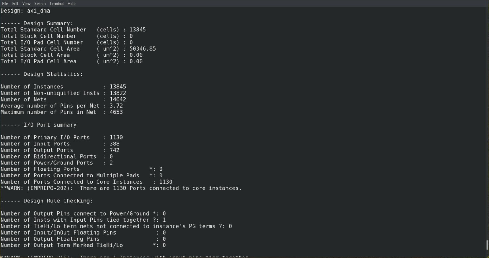
*Design summary confirming 13,845 standard cells, 14,642 nets, 1,130 I/O ports (388 input, 742 output), avg. 3.72 pins/net.*

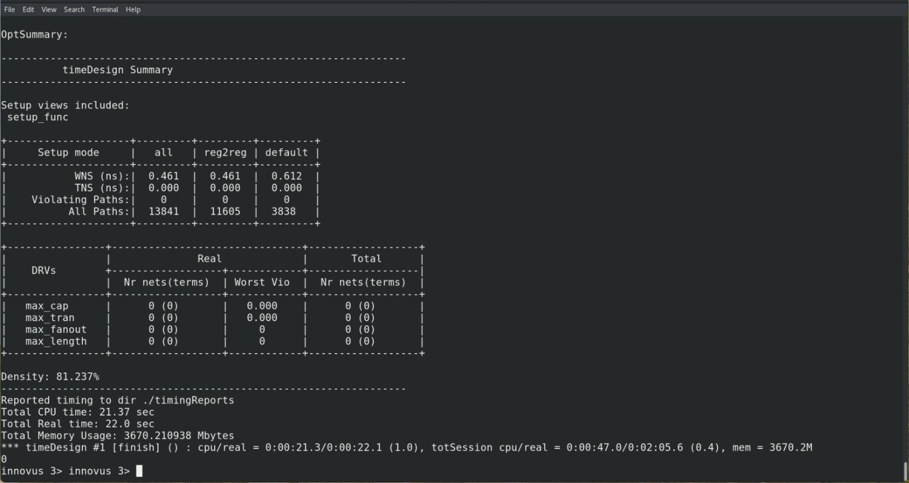
*Post-placement `timeDesign` setup summary — WNS = +0.461 ns, TNS = 0.000 ns, zero violating paths, density = 81.237%, all DRV categories clean.*

### 6. Clock Tree Synthesis — Cadence Innovus

CTS builds and optimizes the physical clock distribution network for the `aclk` domain, inserting buffers/inverters to balance arrival times across all sequential elements. Clock nets are routed using **Non-Default Rules (NDR)** — wider wires and spacing — to protect against crosstalk-induced jitter.

- **Clock skew:** 0.047 ns (0.78% of the 6 ns period)
- **Max clock network latency:** 0.279 ns
- Post-CTS hold worst-case path slack: **+0.053 ns**

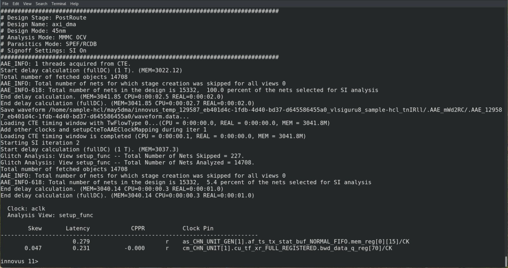
*`report_clock_timing -type skew` — skew = 0.047 ns, network latencies of 0.279 ns / 0.231 ns for the two most-skewed endpoints.*

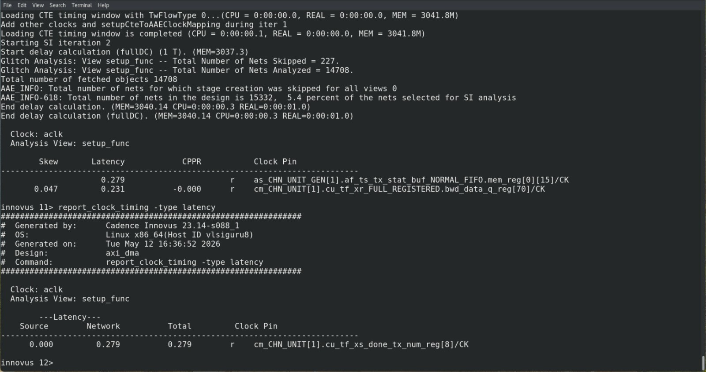
*`report_clock_timing -type latency` — source latency = 0.000 ns, network latency = 0.279 ns, total latency = 0.279 ns.*

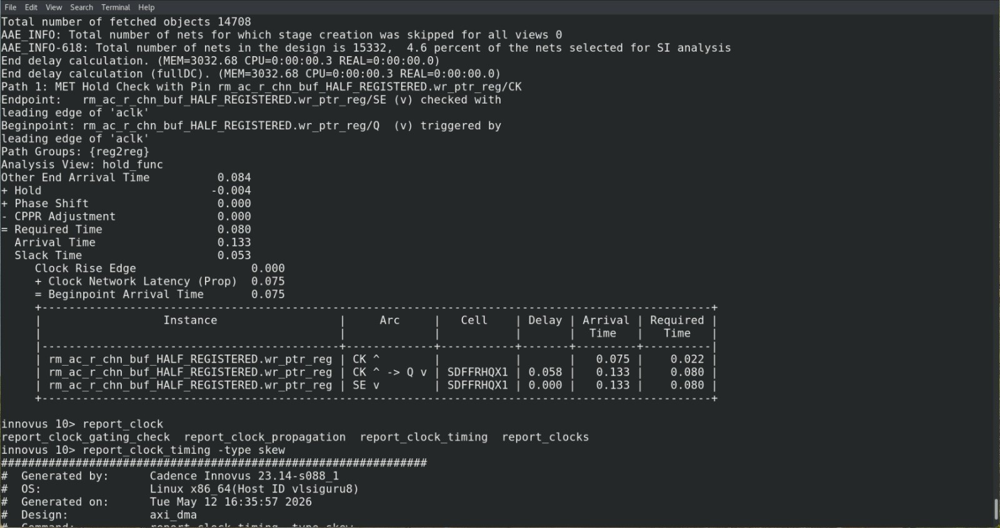
*Post-CTS worst hold path detail — slack = +0.053 ns.*

### 7. Routing — Cadence Innovus

Detailed routing connects all signal nets across **8 metal layers** (Metal1–Metal8, Via1–Via7). The flow proceeds: **global routing** (tile-based congestion estimation) → **track assignment** → **detailed routing** (exact wire geometry per DRC rules).

The router iteratively resolved DRC violations via rip-up-and-reroute, converging to **zero DRC violations** after 5 passes, as reflected in the output database name `route_5_0viol.enc.dat`.

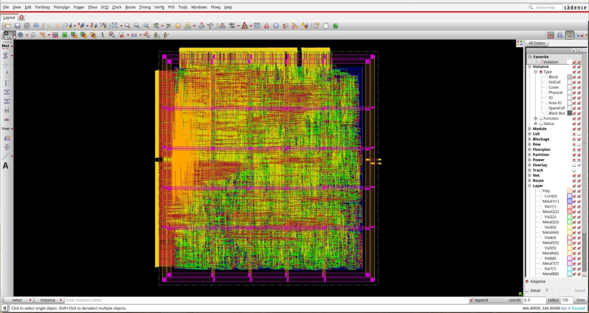
*Post-route layout (`route_5_0viol.enc.dat`) — all signal nets routed across Metal1–Metal8, Metal1/Metal2-heavy local interconnect.*

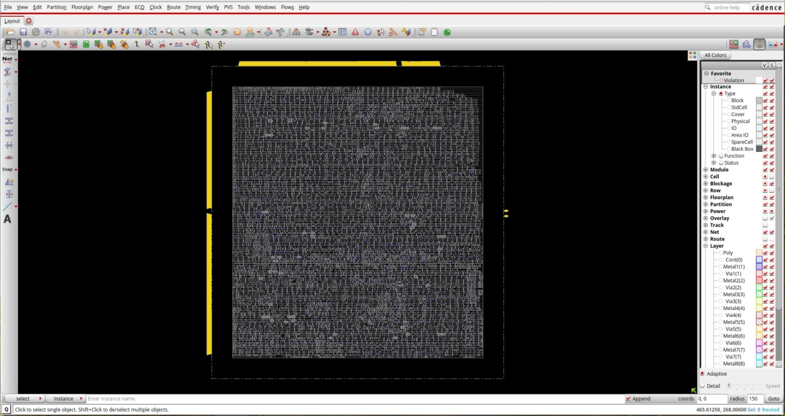
*Skeleton view of placed cell distribution (greyscale/outline mode).*

### 8. Post-Route Analysis & Physical Verification

- `report_area`: **14,226 cells**, total layout area **52,580.790 µm²** (increase from 10,750 at synthesis reflects clock buffers, tie cells, and filler cells).
- `report_timing -late`: worst-case setup path — arrival 5.592 ns, required 6.053 ns, **setup slack +0.461 ns**.
- `verify_drc`: swept all **16 sub-regions**, **zero DRC violations**.
- `verify_connectivity`: processed 15,000+ nets, **zero errors, zero warnings**.

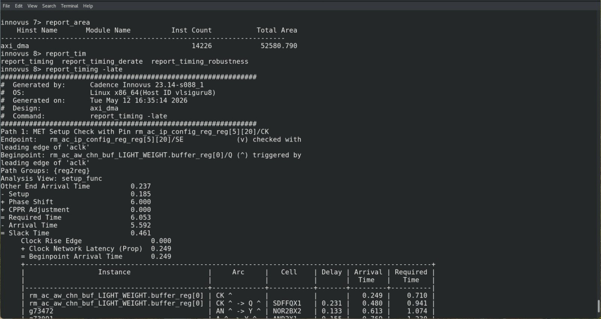
*`report_area` (14,226 instances, 52,580.790 µm²) and `report_timing -late` critical path detail (setup slack = +0.461 ns).*

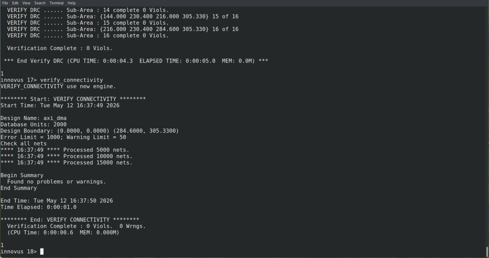
*`verify_drc` — all 16 sub-areas clean; `verify_connectivity` — "Found no problems or warnings", "Verification Complete: 0 Viols. 0 Wrngs."*

### 9. Timing Signoff — Cadence Tempus

The routed, verified design is loaded into **Cadence Tempus Timing Solution 23.14** for signoff-level STA using **SPEF**-extracted RC parasitics and **MMMC OCV** analysis across `setup_func` and `hold_func` views, each with OCV derating applied.

Two full iterations of **Signal Integrity (SI)** analysis (fullDC delay calc) modeled crosstalk-induced delay/glitch effects across all **14,708 analyzed nets**.

Signoff header: Design Stage = PostRoute, Design Mode = 45nm, Analysis Mode = MMMC OCV, Parasitics Mode = SPEF/RCDB, SI = On.

| Check | Result |
|---|---|
| Setup WNS | +0.461 ns (TNS = 0.000 ns, 0 violating paths / 13,841 total) |
| Hold WNS | +0.053 ns (0 violating paths / 11,605 total) |
| Max/min delay, clock period, skew, pulse width, max/min transition, max/min capacitance, max fanout | No violations |

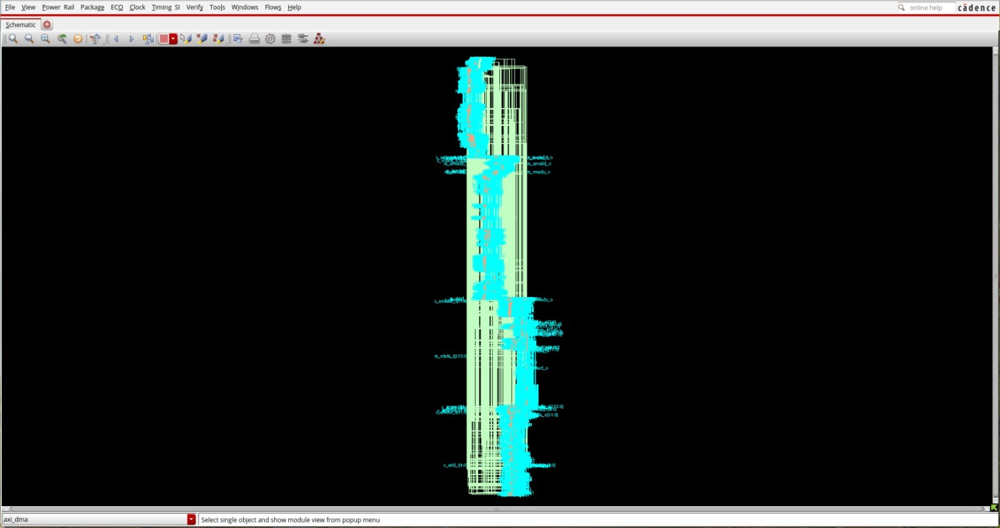
*Cadence Tempus GUI — schematic view of the `axi_dma` design confirming successful load for signoff analysis.*

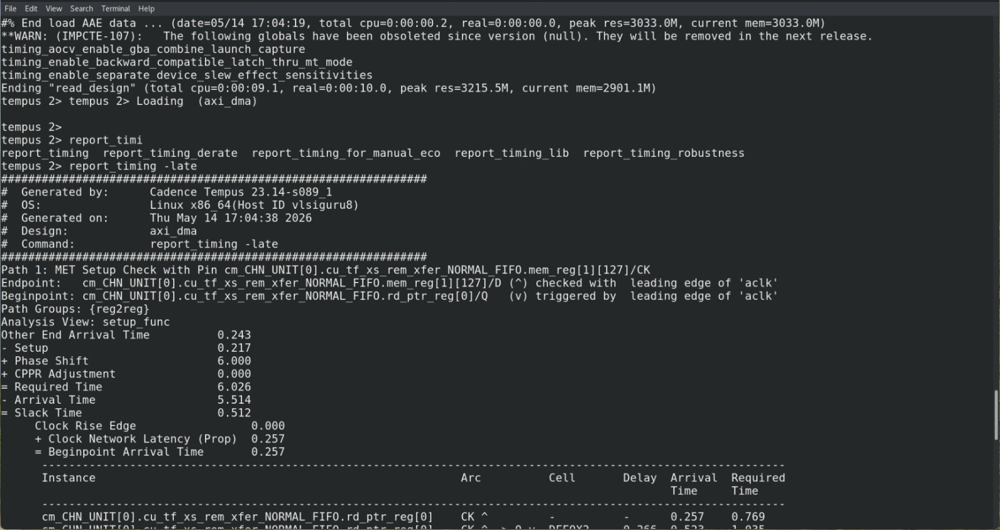
*Setup timing `reportTiming` summary — zero violating paths across 13,841 total setup paths.*

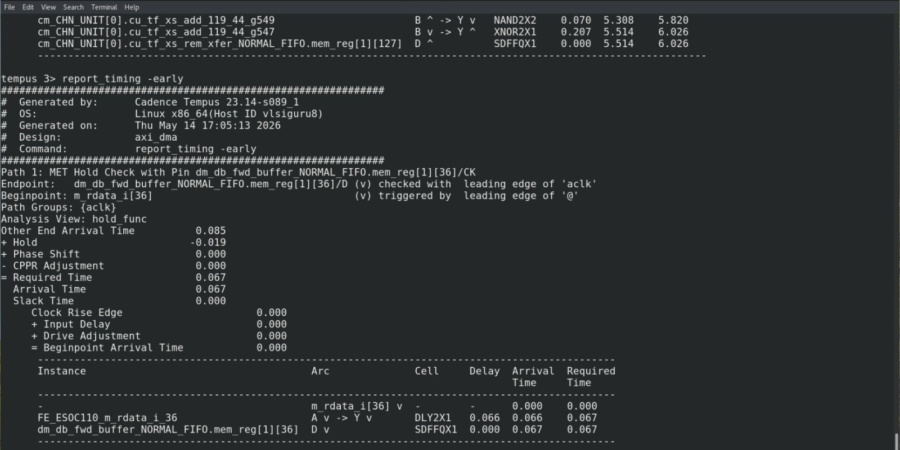
*Hold timing `reportTiming` summary — zero violating paths across 11,605 total hold paths.*

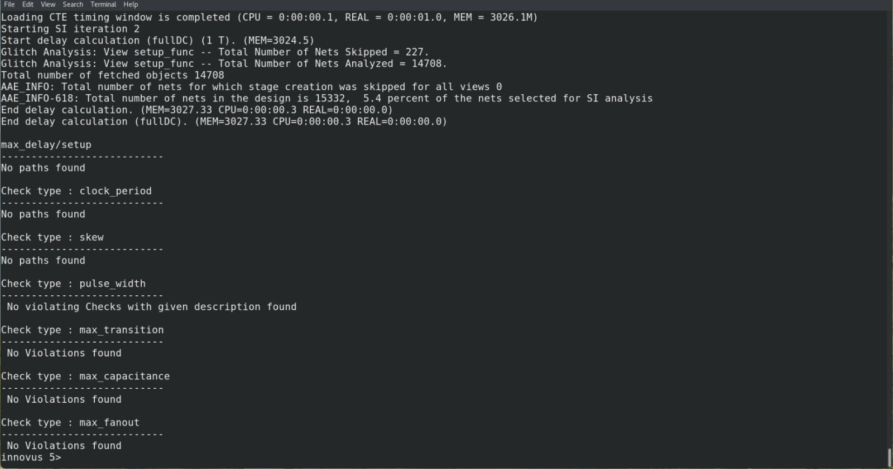
*Innovus check output — max_delay/setup, clock_period, skew, pulse_width, max_transition, max_capacitance, max_fanout: all clean.*

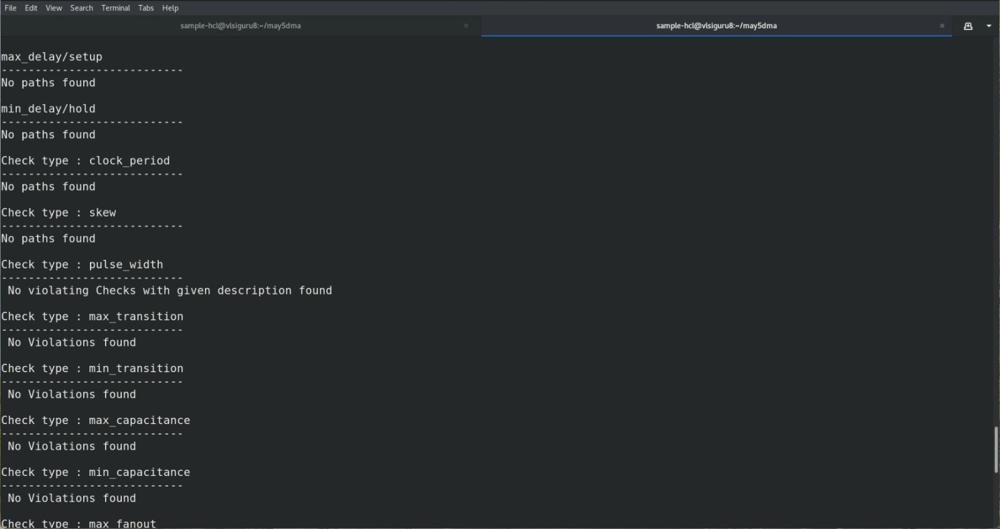
*Tempus check output — min_delay/hold, min_transition, min_capacitance, max_fanout: all clean, completing signoff.*

---

## Results

The design underwent **five iterative rounds** between Cadence Innovus and Cadence Tempus to resolve all setup, hold, and max_transition violations before achieving a fully clean signoff.

### Synthesis Results

Logic synthesis in Cadence Genus mapped the AXI DMA RTL to the 45nm library, producing **10,750 standard cells** at **45,349.884 µm²**. The SDC defined `aclk` @ 6 ns (166.7 MHz) and applied output load constraints across all 742 output ports (2,276 lines).


*Genus GUI confirming Terms (1130), Nets (11,668), StdCells (10,750) after technology mapping and optimization.*

### Physical Implementation Results

Physical implementation in Innovus completed with **zero DRC violations** and **zero connectivity violations** across all 15,000+ nets.


*Final post-route layout (`route_5_0viol.enc.dat`) — fully routed across Metal1–Metal8, zero DRC violations across all 16 sub-regions.*


*`verify_drc` (0 violations across 16 sub-areas) and `verify_connectivity` (0 errors, 0 warnings across 15,000+ nets).*

### GDSII Stream Out

The final layout was streamed to GDSII using the `streamOut` command in Innovus, confirmed by the `######Streamout is finished!` message.

| Item | Count |
|---|---|
| Via instances (signal nets) | 112,407 |
| Via instances (special/power-ground nets) | 3,194 (Metal1, Metal5, Metal6, Metal7) |
| Text labels (total) | 15,951 |
| — Metal1 | 1,164 |
| — Metal2 | 9,049 |
| — Metal3 | 3,577 |
| — Metal4 | 1,235 |
| — Metal5 | 895 |
| — Metal6 | 31 |
| Metal fills / OPCs / DRCs / blockages / custom text / custom boxes / trim metal | 0 (all) |

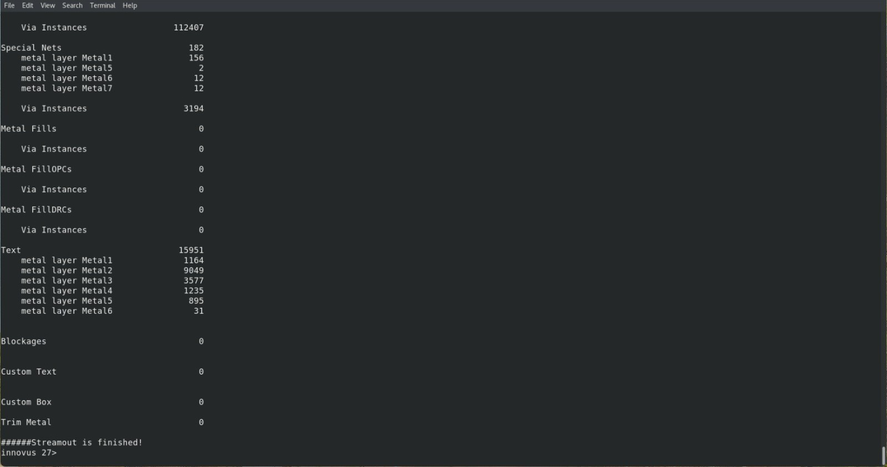
*GDSII stream-out completion report — via counts, text label distribution, zero fills/blockages, and the "Streamout is finished!" confirmation.*

### Timing Closure — Five Iteration Process

Achieving a fully clean signoff required **five iterative rounds** between Innovus and Tempus, resolving setup, hold, and max_transition violations via targeted ECO fixes.

**Setup / Max-Transition Fixes:**
- **Cell upsizing** — critical setup-path cells replaced with higher drive-strength variants (e.g., `AND2X1` → `AND2X2` → `AND2X4`), reducing output transition and propagation delay.
- **LVT cell insertion** — low-threshold-voltage cells inserted on the most timing-critical paths for faster switching and additional setup margin.
- **HVT cell swaps** — high-threshold-voltage cells substituted on non-critical paths, resolving max_transition violations on over-driven nets while reducing leakage.
- **Net repeater insertion** — buffers inserted on long, high-RC nets to break them into shorter segments, reducing transition time and wire-delay-driven setup degradation.

**Hold Violation Fixes:**
- **Delay cell insertion** — `DLYB*` series cells inserted on hold-violating paths to add controlled, logic-neutral delay.
- **Buffer chain insertion** — chains of `BUFX2`/`BUFX4` buffers inserted where a single delay cell was insufficient.
- **HVT buffer insertion** — preferred on non-critical hold paths for longer propagation delay with lower leakage than SVT equivalents.
- **Clock tree rebalancing** — CTS re-run after each ECO iteration to reduce skew-driven hold violations; final skew of 0.047 ns confirmed a well-balanced tree.

### Final Timing Signoff Results

Following five ECO iterations, the final Tempus signoff confirmed a fully clean result across all timing check categories under MMMC OCV analysis with SPEF-extracted parasitics and two SI iterations.


*Cadence Tempus GUI — complete `axi_dma` post-route netlist loaded for signoff STA after five ECO iterations.*


*Final signoff check output — max_delay/setup, min_delay/hold, clock_period, skew, pulse_width, max/min_transition, max/min_capacitance, max_fanout: all "No Violations found."*

### Final Results Summary

| Metric | Value | Status |
|---|---|---|
| Technology | 45nm | — |
| Cell count (post-synthesis) | 10,750 | — |
| Cell area (synthesis) | 45,349.884 µm² | — |
| Cell count (post-route) | 14,226 | — |
| Total layout area | 52,580.790 µm² | — |
| Core utilization | 81.237% | — |
| DRC violations | 0 | CLEAN |
| Connectivity violations | 0 | CLEAN |
| Metal layers used | Metal1–Metal8 | — |
| Clock skew | 0.047 ns | — |
| Max clock latency | 0.279 ns | — |
| Setup WNS | +0.461 ns | MET |
| Setup TNS | 0.000 ns | MET |
| Hold WNS | +0.053 ns | MET |
| Hold TNS | 0.000 ns | MET |
| Total power | 3.216 mW | — |
| Internal power | 2.405 mW (74.8%) | — |
| Switching power | 0.810 mW (25.2%) | — |
| Leakage power | 1.104 µW | — |
| Clock network power | 0.387 mW (12.04%) | — |
| Total iterations | 5 | Converged |
| Setup / max_tran fix | Upsizing, LVT, HVT, repeaters | Applied |
| Hold fix | Delay cells, HVT buffers, CTS | Applied |

---

## Conclusion

This project demonstrates a complete **RTL-to-GDSII physical design flow** for an AXI DMA controller — starting from the Verilog RTL sourced from the Team RTL repository, and taken through synthesis, floorplanning, power planning, placement, clock tree synthesis, routing, and timing signoff using **Cadence Genus, Innovus, and Tempus** on a **45nm CMOS** technology node, producing a fully clean, tapeout-ready layout.

**Key results:**
- Post-route cell count: **14,226 instances**
- Core utilization: **81.237%**
- **Zero** DRC and connectivity violations
- Clock skew: **0.047 ns**
- Setup WNS: **+0.461 ns**, Hold WNS: **+0.053 ns** — zero violating paths
- Timing closure achieved across **five iterative ECO rounds** (cell upsizing, LVT/HVT swaps, repeater/delay-cell insertion, clock tree rebalancing)
- Total design power: **3.216 mW** @ 0.9V

The project provided hands-on experience with the complete ASIC physical design methodology as practiced in the semiconductor industry, covering every stage from RTL to signoff on a real, functionally complete industrial-scale design.

---

## References

1. N. Sherwani, *Algorithms for VLSI Physical Design Automation*, Kluwer Academic Publishers, 1999.
2. J. Bhasker and R. Chadha, *Static Timing Analysis for Nanometer Designs: A Practical Approach*, Springer, 2009.
3. P. Restle and A. Deutsch, "Designing the best clock distribution network," *Symposium on VLSI Circuits*, 2001.
4. P. Pant, D. Blaauw, V. Zolotov, S. Sundareswaran, and R. Panda, "Vectorless analysis of supply noise induced delay variation," *ICCAD*, 2003 / related IR-drop and PDN research (Pant, Panda, Nalasivayam).
5. ARM Limited, *AMBA AXI and ACE Protocol Specification*, 2011.

---

### Repository Structure

```
.
├── figs/                     # All figures referenced in this README
│   ├── axi_dma_block.jpeg
│   ├── rtl_gdsii_flow.jpeg
│   ├── geneus_gui.jpeg
│   ├── genus_area.jpeg
│   ├── netlist.jpeg
│   ├── sdc.jpeg
│   ├── init_fp.jpeg
│   ├── fppin.jpeg
│   ├── report_power.jpeg
│   ├── placement_layer.jpeg
│   ├── design_sum.jpeg
│   ├── timedesign_setup.jpeg
│   ├── cts_skew.jpeg
│   ├── cts_layout.jpeg
│   ├── hold_path_cts.jpeg
│   ├── route_layer.jpeg
│   ├── stdcells.jpeg
│   ├── report_area_timing.jpeg
│   ├── drc_connectivity.jpeg
│   ├── tempus_sch.jpeg
│   ├── tempus_setup.jpeg
│   ├── tempus_hold.jpeg
│   ├── innovus_violation_checks.jpeg
│   ├── tempus_violation_check.jpeg
│   └── gds.jpeg
└── README.md
```

> **Note:** The RTL source for the `axi_dma` design was obtained from a third-party Team RTL repository and is not authored by this project; this repository documents only the physical design (synthesis-to-GDSII) work performed on top of that RTL.
